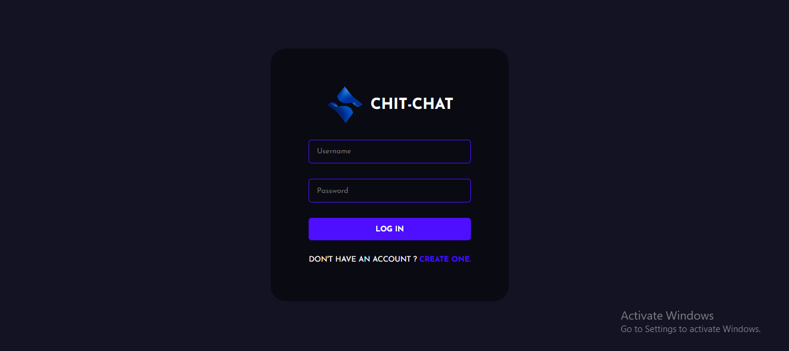
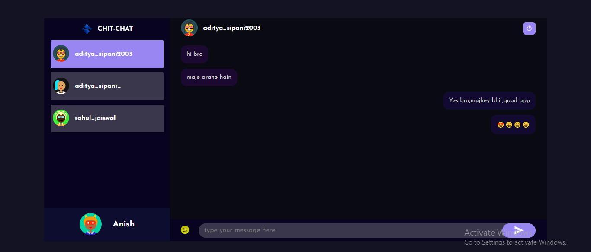

# Chit-Chat - Chat Application 
Chit-Chat is chat application build with the power of MERN Stack.





## Installation Guide

### Requirements
- [Nodejs](https://nodejs.org/en/download)
- [Mongodb](https://www.mongodb.com/docs/manual/administration/install-community/)

Both should be installed and make sure mongodb is running.
### Installation

#### First Method
```shell
git clonehttps://github.com/adityasipani/chit-chat.git
cd chat-app-react-nodejs
```
Now rename env files from .env.example to .env
```shell
cd client
mv .env.example .env
cd ..
cd server
mv .env.example .env
cd ..
```

Now install the dependencies
```shell
cd server
yarn
cd ..
cd client
yarn
```
We are almost done, Now just start the development server.

For Frontend.
```shell
cd client
yarn start
```
For Backend.

Open another terminal in folder, Also make sure mongodb is running in background.
```shell
cd server
yarn start
```
Done! Now open localhost:3000 in your browser.
```
now open localhost:3000 in your browser.
